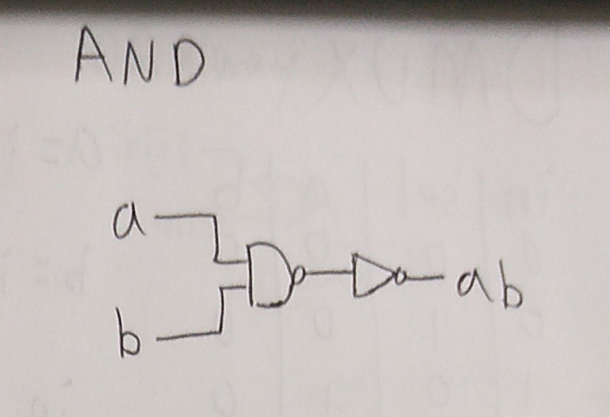
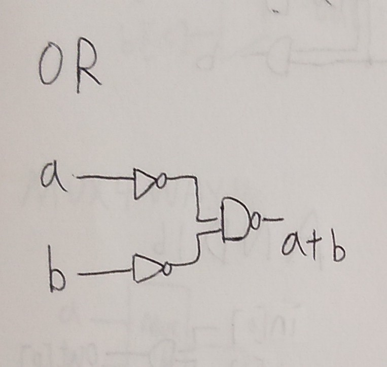
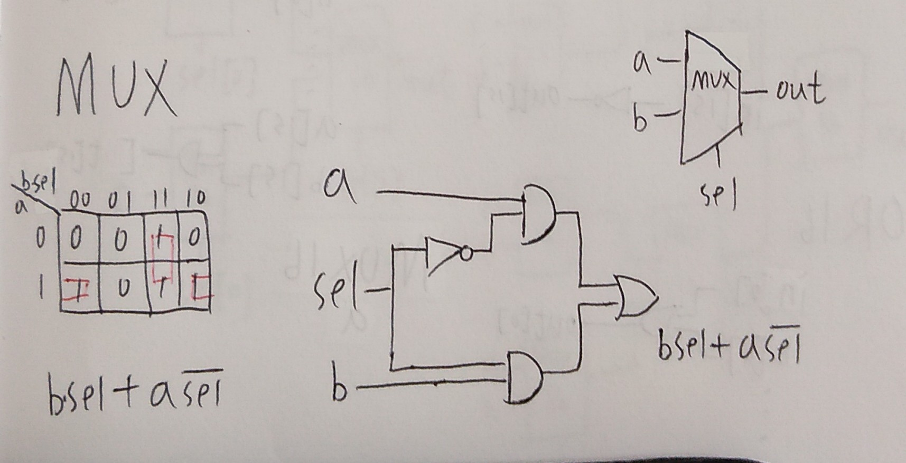
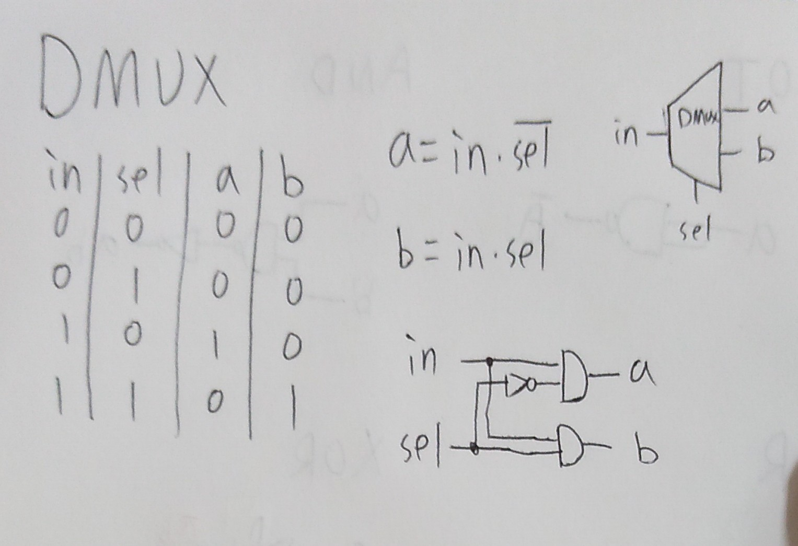

## 第一章前六題
# NOT
 

```
CHIP Not {
    IN in;
    OUT out;

    PARTS:
    // Put your code here:
    Nand(a=in, b=in, out=out);
}
```
# AND
 

```
CHIP And {
    IN a, b;
    OUT out;

    PARTS:
    Nand(a=a, b=b, out=ANandB);//NAND = AND + NOT
    Not(in=ANandB, out=out);// NAND + NOT = AND
    // Put your code here:
}
```
# OR
 

```
CHIP Or {
    IN a, b;
    OUT out;

    PARTS:
    Not(in=a, out=aNot);
    Not(in=b, out=bNot);
    Nand(a=aNot, b=bNot, out=out);
    // Put your code here:
}
``` 

# MUX
 

```
CHIP Mux {
    IN a, b, sel;
    OUT out;

    PARTS:
    Not(in=sel, out=nsel);
    And(a=sel, b=b, out=bsel);
    And(a=a, b=nsel, out=ansel);
    Or(a=ansel, b=bsel, out=out);
    // Put your code here:
}
``` 

# DMUX


```
CHIP DMux {
    IN in, sel;
    OUT a, b;

    PARTS:
    Not(in=sel, out=nsel);
    And(a=in, b=nsel, out=a);
    And(a=in, b=sel, out=b);
    // Put your code here:
}
```