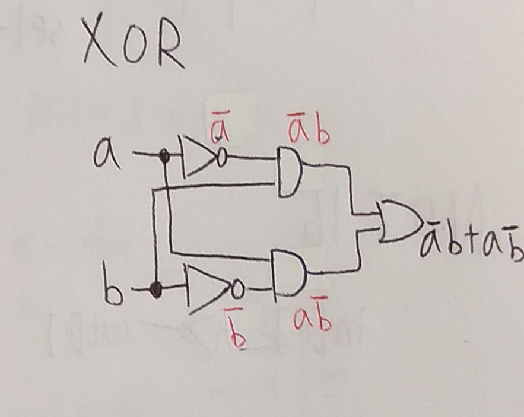

## 第一章前六題

# NOT
 
<<<<<<< HEAD
```
// This file is part of www.nand2tetris.org
// and the book "The Elements of Computing Systems"
// by Nisan and Schocken, MIT Press.
// File name: projects/01/Not.hdl

/**
 * Not gate:
 * out = not in
 */

=======

```
>>>>>>> 49744e4a874a33ad6e9e5f2c71860a792e7fd3e7
CHIP Not {
    IN in;
    OUT out;

    PARTS:
    // Put your code here:
    Nand(a=in, b=in, out=out); //a=in,b=in是內部皆限制外部
<<<<<<< HEAD
}
```
=======
}
```


# AND


```
CHIP And {
    IN a, b;
    OUT out;

    PARTS:
    Nand(a=a, b=b, out=ANandB);
    Not(in=ANandB, out=out);
    // Put your code here:
}

```

# OR
 

```
CHIP Or {
    IN a, b;
    OUT out;

    PARTS:
    Not(in=a, out=aNot);
    Not(in=b, out=bNot);
    Nand(a=aNot, b=bNot, out=out);
    // Put your code here:
}
```

# XOR


```
CHIP Xor {
    IN a, b;
    OUT out;

    PARTS:
    Not(in=a, out=na);
    Not(in=b, out=nb);
    And(a=a, b=nb, out=Anb);
    And(a=na, b=b, out=naB);
    Or(a=Anb, b=naB, out=out);
    // Put your code here:
}
```
# MUX


```
CHIP Mux {
    IN a, b, sel;
    OUT out;

    PARTS:
    Not(in=sel, out=nsel);
    And(a=sel, b=b, out=bsel);
    And(a=a, b=nsel, out=ansel);
    Or(a=ansel, b=bsel, out=out);
    // Put your code here:
}
```
# DMUX
 

```
CHIP DMux {
    IN in, sel;
    OUT a, b;

    PARTS:
    Not(in=sel, out=nsel);
    And(a=in, b=nsel, out=a);
    And(a=in, b=sel, out=b);
    // Put your code here:
}
```
>>>>>>> 49744e4a874a33ad6e9e5f2c71860a792e7fd3e7
