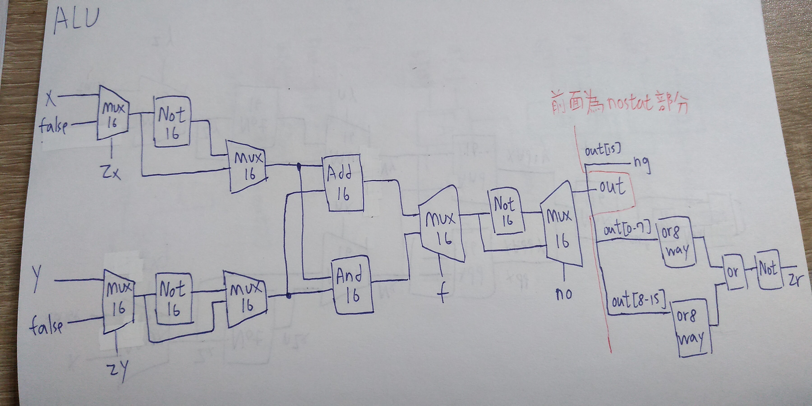

# 第二章完成

## ALU-nostat

```
CHIP ALU {
    IN  
        x[16], y[16],  // 16-bit inputs        
        zx, // zero the x input?
        nx, // negate the x input?
        zy, // zero the y input?
        ny, // negate the y input?
        f,  // compute out = x + y (if 1) or x & y (if 0)
        no; // negate the out output?

    OUT 
        out[16], // 16-bit output
        zr, // 1 if (out == 0), 0 otherwise
        ng; // 1 if (out < 0),  0 otherwise

    PARTS:
    Mux16(a=x, b=false, sel=zx, out=Zx);            // if (zx == 1) set x = 0 
    Not16(in=Zx, out=nZx);                      // set !x
    Mux16(a=Zx, b=nZx, sel=nx, out=Nx);         // if (nx == 1) set x = !x

    Mux16(a=y, b=false, sel=zy, out=Zy);            // if (zy == 1) set y = 0
    Not16(in=Zy, out=nZy);             
    Mux16(a=Zy, b=nZy, sel=ny, out=Ny);         // if (ny == 1) set y = !y

    Add16(a=Nx, b=Ny, out=xaddy);             // if (f == 1)  set out = x + y
    And16(a=Nx, b=Ny, out=xandy);             // if (f == 0)  set out = x & y
    Mux16(a=xandy, b=xaddy, sel=f, out=Out);

    Not16(in=Out, out=nOut);   
    Mux16(a=Out, b=nOut, sel=no, out=out);      // if (no == 1) set out = !out
   // Put you code here:
}
```

## ALU
```
CHIP ALU {
    IN  
        x[16], y[16],  // 16-bit inputs        
        zx, // zero the x input?
        nx, // negate the x input?
        zy, // zero the y input?
        ny, // negate the y input?
        f,  // compute out = x + y (if 1) or x & y (if 0)
        no; // negate the out output?

    OUT 
        out[16], // 16-bit output
        zr, // 1 if (out == 0), 0 otherwise
        ng; // 1 if (out < 0),  0 otherwise

    PARTS:
    Mux16(a=x, b=false, sel=zx, out=Zx);            // if (zx == 1) set x = 0 
    Not16(in=Zx, out=nZx);                      // set !x
    Mux16(a=Zx, b=nZx, sel=nx, out=Nx);         // if (nx == 1) set x = !x

    Mux16(a=y, b=false, sel=zy, out=Zy);            // if (zy == 1) set y = 0
    Not16(in=Zy, out=nZy);             
    Mux16(a=Zy, b=nZy, sel=ny, out=Ny);         // if (ny == 1) set y = !y

    Add16(a=Nx, b=Ny, out=xaddy);             // if (f == 1)  set out = x + y
    And16(a=Nx, b=Ny, out=xandy);             // if (f == 0)  set out = x & y
    Mux16(a=xandy, b=xaddy, sel=f, out=Out);

    Not16(in=Out, out=nOut);   
    Mux16(a=Out, b=nOut, sel=no, out=out, out[0..7]=o1, out[8..15]=o2, out[15]=ng);      // if (no == 1) set out = !out

    Or8Way(in=o1, out=out1);
    Or8Way(in=o2, out=out2);
    Or(a=out1, b=out2, out=out3);
    Not(in=out3, out=zr);


// if (out == 0) set zr = 1
// if (out < 0) set ng = 1
   // Put you code here:
}
```
 