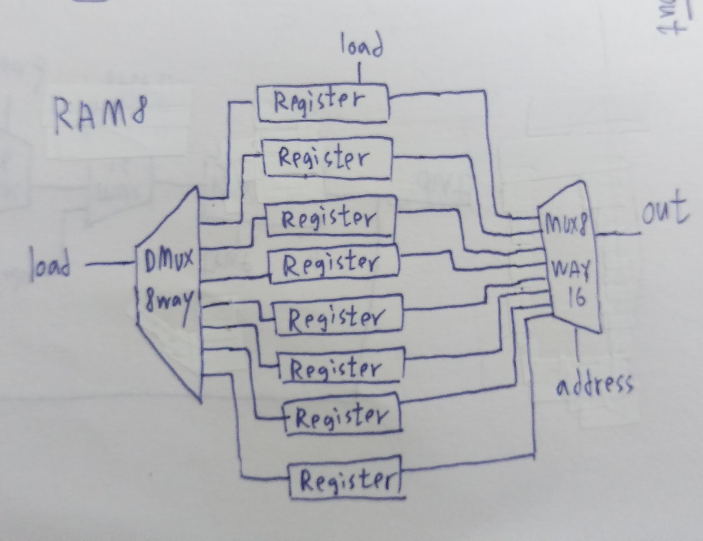
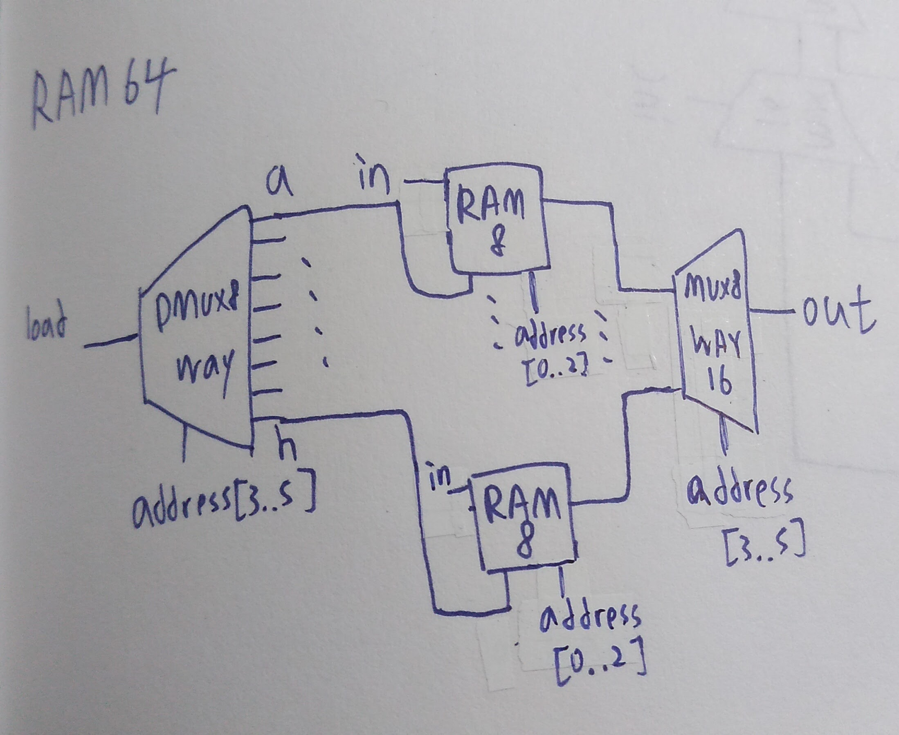
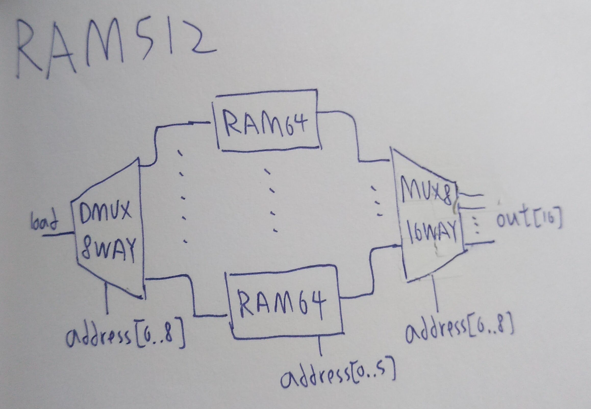
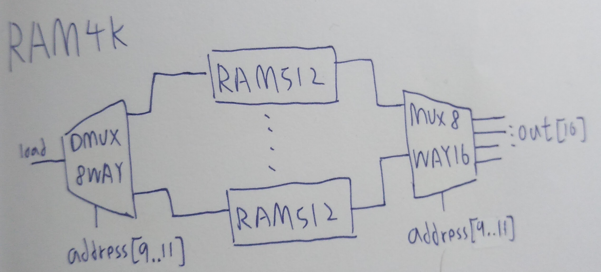
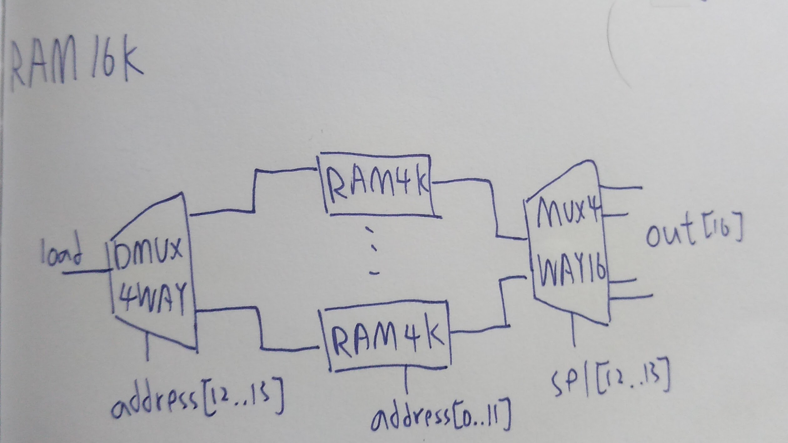

## RAM8
 

```
// This file is part of www.nand2tetris.org
// and the book "The Elements of Computing Systems"
// by Nisan and Schocken, MIT Press.
// File name: projects/03/a/RAM8.hdl

/**
 * Memory of 8 registers, each 16 bit-wide. Out holds the value
 * stored at the memory location specified by address. If load==1, then 
 * the in value is loaded into the memory location specified by address 
 * (the loaded value will be emitted to out from the next time step onward).
 */

CHIP RAM8 {
    IN in[16], load, address[3];
    OUT out[16];

    PARTS:
    DMux8Way(in=load, sel=address, a=da, b=db, c=dc, d=dd, e=de, f=df, g=dg, h=dh);

    Register(in=in, load=da, out=r1);
    Register(in=in, load=db, out=r2);
    Register(in=in, load=dc, out=r3);
    Register(in=in, load=dd, out=r4);
    Register(in=in, load=de, out=r5);
    Register(in=in, load=df, out=r6);
    Register(in=in, load=dg, out=r7);
    Register(in=in, load=dh, out=r8);

    Mux8Way16(a=r1, b=r2, c=r3, d=r4, e=r5, f=r6, g=r7, h=r8, sel=address, out=out);
    // Put your code here:
}
```

## RAM64
 

```
// This file is part of www.nand2tetris.org
// and the book "The Elements of Computing Systems"
// by Nisan and Schocken, MIT Press.
// File name: projects/03/a/RAM64.hdl

/**
 * Memory of 64 registers, each 16 bit-wide. Out holds the value
 * stored at the memory location specified by address. If load==1, then 
 * the in value is loaded into the memory location specified by address 
 * (the loaded value will be emitted to out from the next time step onward).
 */

CHIP RAM64 {
    IN in[16], load, address[6];
    OUT out[16];

    PARTS:
    DMux8Way(in=load, sel=address[3..5], a=a, b=b, c=c, d=d, e=e, f=f, g=g, h=h);
    RAM8(in=in, load=a, address=address[0..2], out=A);
    RAM8(in=in, load=b, address=address[0..2], out=B);
    RAM8(in=in, load=c, address=address[0..2], out=C);
    RAM8(in=in, load=d, address=address[0..2], out=D);
    RAM8(in=in, load=e, address=address[0..2], out=E);
    RAM8(in=in, load=f, address=address[0..2], out=F);
    RAM8(in=in, load=g, address=address[0..2], out=G);
    RAM8(in=in, load=h, address=address[0..2], out=H);

    Mux8Way16(a=A, b=B, c=C, d=D, e=E, f=F, g=G, h=H, sel=address[3..5], out=out);
    // Put your code here:
}
```

## RAM512
 

```
// This file is part of the materials accompanying the book 
// "The Elements of Computing Systems" by Nisan and Schocken, 
// MIT Press. Book site: www.idc.ac.il/tecs
// File name: projects/03/b/RAM512.hdl

/**
 * Memory of 512 registers, each 16 bit-wide. Out holds the value
 * stored at the memory location specified by address. If load==1, then 
 * the in value is loaded into the memory location specified by address 
 * (the loaded value will be emitted to out from the next time step onward).
 */

CHIP RAM512 {
    IN in[16], load, address[9];
    OUT out[16];

    PARTS:
    DMux8Way(in=load, sel=address[6..8], a=a, b=b, c=c, d=d, e=e, f=f, g=g, h=h);
    
    RAM64(in=in, load=a, address=address[0..5], out=A);
    RAM64(in=in, load=b, address=address[0..5], out=B);
    RAM64(in=in, load=c, address=address[0..5], out=C);
    RAM64(in=in, load=d, address=address[0..5], out=D);
    RAM64(in=in, load=e, address=address[0..5], out=E);
    RAM64(in=in, load=f, address=address[0..5], out=F);
    RAM64(in=in, load=g, address=address[0..5], out=G);
    RAM64(in=in, load=h, address=address[0..5], out=H);

    Mux8Way16(a=A, b=B, c=C, d=D, e=E, f=F, g=G, h=H, sel=address[6..8], out=out);
    // Put your code here:
}
```

## RAM4K
 

```
// This file is part of www.nand2tetris.org
// and the book "The Elements of Computing Systems"
// by Nisan and Schocken, MIT Press.
// File name: projects/03/b/RAM4K.hdl

/**
 * Memory of 4K registers, each 16 bit-wide. Out holds the value
 * stored at the memory location specified by address. If load==1, then 
 * the in value is loaded into the memory location specified by address 
 * (the loaded value will be emitted to out from the next time step onward).
 */

CHIP RAM4K {
    IN in[16], load, address[12];
    OUT out[16];

    PARTS:
    // Put your code here:
    DMux8Way(in=load, sel=address[9..11], a=a, b=b, c=c, d=d, e=e, f=f, g=g, h=h);
    RAM512(in=in, load=a, address=address[0..8], out=A);
    RAM512(in=in, load=b, address=address[0..8], out=B);
    RAM512(in=in, load=c, address=address[0..8], out=C);
    RAM512(in=in, load=d, address=address[0..8], out=D);
    RAM512(in=in, load=e, address=address[0..8], out=E)
    RAM512(in=in, load=f, address=address[0..8], out=F);
    RAM512(in=in, load=g, address=address[0..8], out=G);
    RAM512(in=in, load=h, address=address[0..8], out=H);
    Mux8Way16(a=A, b=B, c=C, d=D, e=E, f=F, g=G, h=H, sel=address[6..8], out=out);
}
```

## RAM16K
 

```
// This file is part of www.nand2tetris.org
// and the book "The Elements of Computing Systems"
// by Nisan and Schocken, MIT Press.
// File name: projects/03/b/RAM16K.hdl

/**
 * Memory of 16K registers, each 16 bit-wide. Out holds the value
 * stored at the memory location specified by address. If load==1, then 
 * the in value is loaded into the memory location specified by address 
 * (the loaded value will be emitted to out from the next time step onward).
 */

CHIP RAM16K {
    IN in[16], load, address[14];
    OUT out[16];

    PARTS:
    DMux4Way(in=load, sel=address[12..13], a=a, b=b, c=c, d=d);
    RAM4K(in=in, load=a, address=address[0..11], out=A);
    RAM4K(in=in, load=b, address=address[0..11], out=B);
    RAM4K(in=in, load=c, address=address[0..11], out=C);
    RAM4K(in=in, load=d, address=address[0..11], out=D);
    Mux4Way16(a=A, b=B, c=C, d=D, sel=sel[12..13], out=out);
    // Put your code here:
}
```