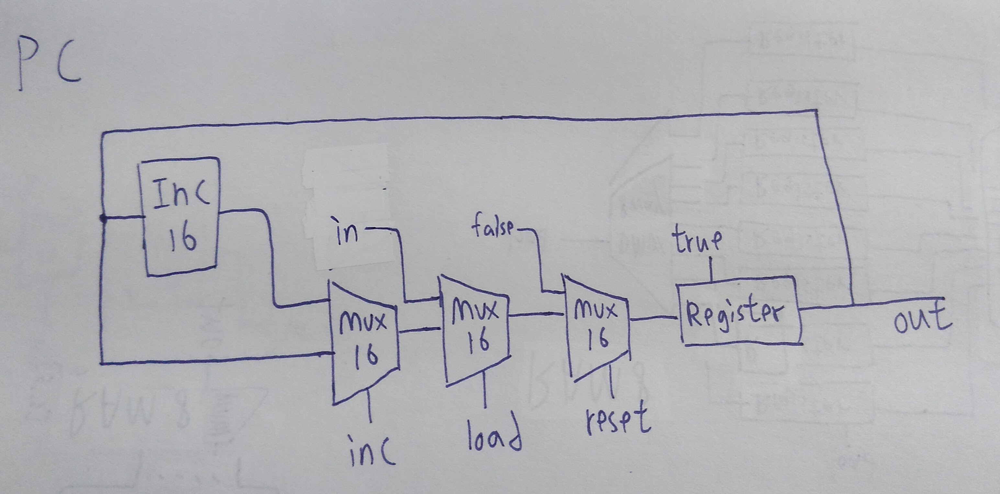

## PC
 

```
// This file is part of www.nand2tetris.org
// and the book "The Elements of Computing Systems"
// by Nisan and Schocken, MIT Press.
// File name: projects/03/a/PC.hdl

/**
 * A 16-bit counter with load and reset control bits.
 * if      (reset[t] == 1) out[t+1] = 0
 * else if (load[t] == 1)  out[t+1] = in[t]
 * else if (inc[t] == 1)   out[t+1] = out[t] + 1  (integer addition)
 * else                    out[t+1] = out[t]
 */

CHIP PC {
    IN in[16],load,inc,reset;
    OUT out[16];

    PARTS:
    Inc16(in=oo, out=oinc);
    Mux16(a=oo, b=oinc, sel=inc, out=out1);//out[t+1] = out[t] + 1
    Mux16(a=out1, b=in, sel=load, out=out2); //out[t+1] = in[t]
    Mux16(a=out2, b=false, sel=reset, out=o);
    Register(in=o, load=true, out=out, out=oo);

    // Put your code here:
}

```
