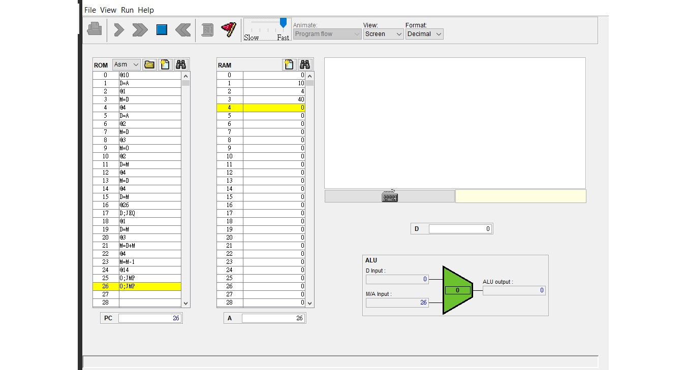

## mult.asm

## C程式碼

```
#include<stdio.h>

int main()
{
    int x=10;
    int y=4;
    int i=1;
                
                
    loop:	 		
        if(i>y)		goto EXIT;        
        x += x;		
        i += 1;		
        goto loop;		

        EXIT:
        printf("%d", x);
        return 0;	
}
```

## 機器語言

```
@10
D=A
@1  //X
M=D
@4
D=A
@2  //Y
M=D
@3  //N
M=0
@2  
D=M
@4  //i=y
M=D
(LOOP)
@4
D=M
@EXIT
D;JEQ
@1
D=M
@3
M=M+D
@4
M=M-1
@LOOP
0;JMP                                                                                                                                                                                                                                              
(EXIT)
0;JMP
```
 