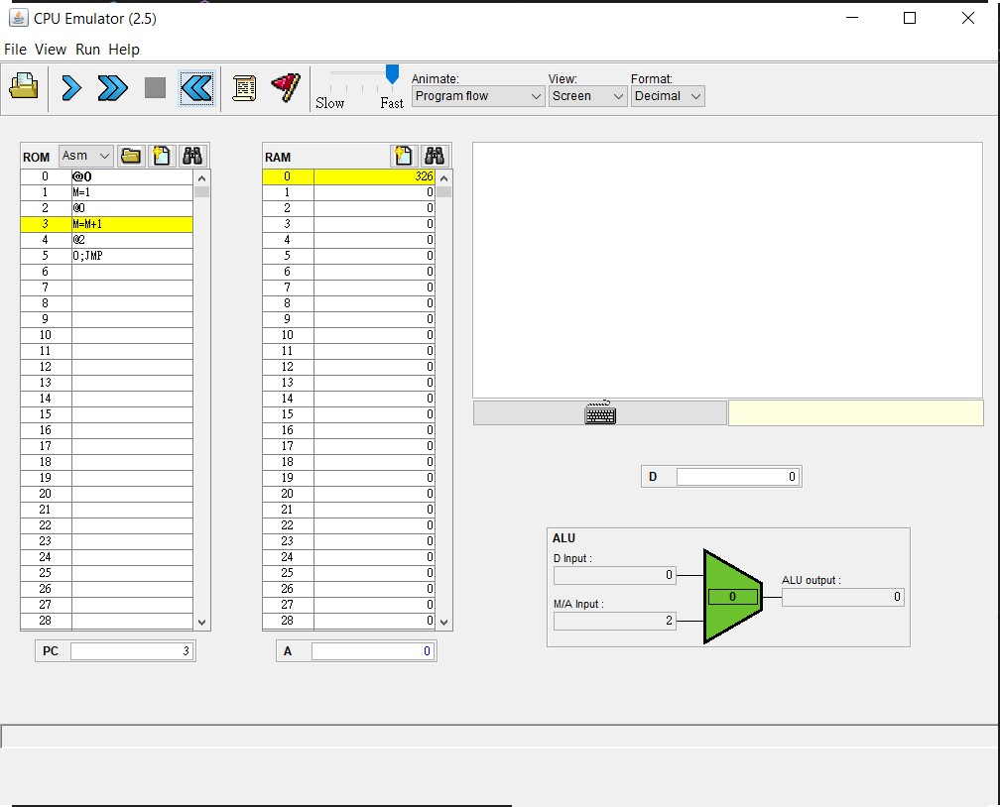

```
#include<stdio.h>
/*
R0=1
while (1) {
  R0=R0+1
}
*/
int main(){
    int R0 = 1; //@0, M=1
    LOOP://(LOOP)
        if(R0 == 20){
          goto EXIT;
        }
        R0 += 1;//@0, M=M+1
        printf("R0 = %d\n", R0);
        goto LOOP;//@LOOP, 0; JMP
    EXIT://(EXIT)
        return 0;
}
```
 